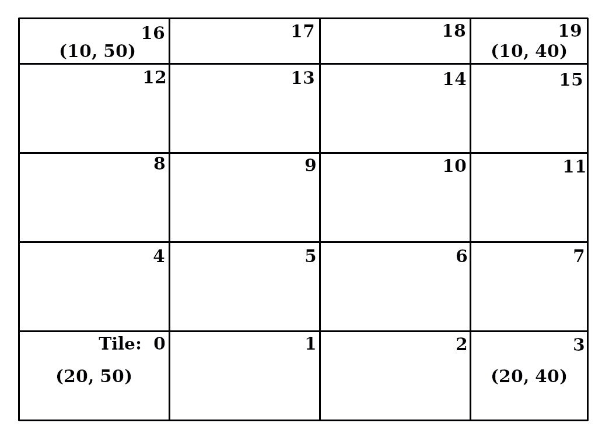

.. py:module:: so3g.proj

====================================
Pointing and Projections (so3g.proj)
====================================

Overview
========

This module contains fast and/or flexible routines for pointing
computations that are required in the context of time-ordered data and
map-making.  The main focus is on rapid conversion from horizon
coordinates to celestial coordinates.  On-the-fly conversion to
projection plane coordinates and accumulation of detector data into
maps (without storing long position or pixel vectors) is also
supported.

The basic acceleration approach used here is to express the rotation
that takes a detector to the celestial sky as a product of a (fixed)
rotation that take each detector to some reference position in the
focal plane and a rotation that takes the reference position in the
focal plane to the celestial sky, as a function of time.  This is an
approximation insofar as non-linear effects such as atmospheric
refraction and aberration add an additional dependence on the horizon
and celestial pointing of a detector.  But having accounted for the
mean effects, at the reference position, the errors incurred on nearby
detectors in the focal plane may be small enough to ignore.

Dependencies
============

To take full advantage of this module, you will want to install these
packages:

- https://github.com/arahlin/qpoint : for high-precision astrometry.
- https://github.com/simonsobs/pixell : for rectilinear sky map
  operations.


Tutorial
========

.. Links for text below.

.. _pixell:  https://pixell.readthedocs.io/
.. _WCS:  https://docs.astropy.org/en/stable/wcs/


Import
------

Because the Projection module has special requirements, it must be
explicitly imported for use.  It is likely you'll also need numpy::

  import so3g.proj
  import numpy as np

Horizon to equatorial coordinates
---------------------------------

The :class:`CelestialSightLine` class is used to store a
time-dependent rotation from focal plane coordinates to celestial
coordinates.  To create such an object based on the horizon
coordinates of a telescope boresight, you must pass in the az, el, and
time (as a unix timestamp), as well as a description of the telescope
site and the weather conditions::

  # Define DEG, carrying conversion from degrees to radians.
  DEG = np.pi / 180

  # Vectors of time, azimuth, and elevation.
  t = [1900000000.]
  az = [180. * DEG]
  el = [60. * DEG]

  # Construct a SightLine from this information.
  csl = so3g.proj.CelestialSightLine.az_el(t, az, el,
      site='so', weather='typical')

After instantiation, ``csl`` will have a member ``Q`` that holds the
rotation quaternion from focal plane to celestial coordinates.  The
:func:`coords() <CelestialSightLine.coords>` method can decompose such
quaternions into rotation angles::

  >>> csl.Q
  spt3g.core.G3VectorQuat([(-0.0384748,0.941783,0.114177,0.313891)])

  >>> csl.coords()
  array([[ 0.24261138, -0.92726871, -0.99999913, -0.00131952]])

The :func:`coords() <CelestialSightLine.coords>` returns an array with
shape (n_time, 4); each 4-tuple contains values ``(lon, lat,
cos(gamma), sin(gamma))``.  The ``lon`` and ``lat`` are the celestial
longitude and latitude coordinates (typically Right Ascension and
Declination), in radians, and gamma is the parallactic angle (the
angle between the directions of increasing declination and increasing
elevation at that point, with 0 corresponding to North, increasing
towards West).

You can get the vectors of RA and dec, in degrees like this::

  >>> ra, dec = csl.coords().transpose()[:2] / DEG
  >>> print(ra, dec)
  [13.90060809] [-53.12858329]


Pointing for many detectors
---------------------------

Create a :class:`FocalPlane` object, with some detector positions and
orientations::

  xi  = np.array([-0.5, 0.0, 0.5]) * DEG
  eta = np.zeros(3)
  gamma = np.array([0,30,60]) * DEG
  fp  = so3g.proj.FocalPlane.from_xieta(xi, eta, gamma)

This particular function, :func:`from_xieta()
<FocalPlane.from_xieta>`, will apply the SO standard coordinate
definitions and stores quaternions (``.quats``) and
responsivities (``.resps``) for each detector. These are a
``G3VectorQuat``  wth length ``ndet`` and a numpy array
with shape ``[ndet,2]`` respectively. ``fp.quats[0]`` gives
the quaternion for the first detector, while ``fp.resps[0]``
gives its total intensity and polarization responsivity.::

  >>> fp.quats[2]
  spt3g.core.quat(0.866017,0.00377878,-0.00218168,0.499995)
  >>> fp.resps[2]
  array([1., 1.], dtype=float32)

As you can see, the default responsivity is 1 for both total
intensty and polarization. To represent detectors with
responsivity different from 1, use the ``T`` and ``P``
arguments to :func:`from_xieta()` to set the total intensity
and polarization responsivity respectively. These can be
either single numbers or array-likes with lengths ``ndet``.::

  xi  = np.array([-0.5, 0.0, 0.5]) * DEG
  eta = np.zeros(3)
  gamma = np.array([0,30,60]) * DEG
  T   = np.array([1.0, 0.9, 1.1])
  P   = np.array([0.5, 0.6, 0.05])
  fp2 = so3g.proj.FocalPlane.from_xieta(xi, eta, gamma, T=T, P=P)

Together, gamma, T and P specify the full responsivity of a
detector to the T, Q and U Stokes parameters in focal plane
coordinates. But as an alternative, it's also possible to
specify these directly. The example above is equivalent to::

  xi  = np.array([-0.5, 0.0, 0.5]) * DEG
  eta = np.zeros(3)
  gamma = np.array([0,30,60]) * DEG
  T   = np.array([1.0, 0.9, 1.1])
  Q   = np.array([0.5, 0.3, -0.025])
  U   = np.array([0.0, 0.51961524, 0.04330127])
  fp2 = so3g.proj.FocalPlane.from_xieta(xi, eta, T=T, Q=Q, U=U)

At this point you could get the celestial coordinates for any one of
those detectors::

  # Get vector of quaternion pointings for detector 0
  q_total = csl.Q * fp.quats[0]
  # Decompose q_total into lon, lat, roll angles
  ra, dec, gamma = so3g.proj.quat.decompose_lonlat(q_total)

As expected, these coordinates are close to the ones computed before,
for the boresight::

  >>> print(ra / DEG, dec / DEG)
  [14.73387143] [-53.1250149]

But the more expedient way to get pointing for multiple detectors is
to call :func:`coords() <CelestialSightLine.coords>` with the
FocalPlane object as first argument::

  >>> csl.coords(fp)
  [array([[ 0.25715457, -0.92720643,  0.9999161 ,  0.01295328]]),
   array([[ 0.24261138, -0.92726871,  0.86536489,  0.5011423 ]]),
   array([[ 0.22806774, -0.92722945,  0.50890634,  0.86082189]])]

So ``coords()`` returns a list of numpy arrays with shape (n_time,4),
and at each time step the 4 elements of the array are: ``(lon, lat,
cos(gamma), sin(gamma))``.


Projecting to Maps
------------------

Accelerated projection routines for various pixelizations have been
written using C++ templates.  Abstraction at the Python level is
provided by the :class:`Projectionist` class, which decodes the map
WCS description in order to choose the right accelerated pointing
projection routines (encapsulated in a C++ class called a ProjEng).

This code relies on `pixell`_ library for working with sky maps that
are represented as numpy arrays tied to astropy `WCS`_ objects describing the
rectangular pixelization.

Let's start by creating a suitable map; we choose a supported
projection, and make sure it contains the particular points touched by
our example from above::

  from pixell import enmap
  shape, wcs = enmap.geometry([[-54*DEG, 16.*DEG], [-52*DEG, 12.*DEG]],
    res=.02*DEG, proj='car')

Note that arguments to most ``enmap`` functions are specified in (dec,
RA) order, because of the typical correspondence between the RA
direction and matrix column (the fastest index of the map array).  The
``shape`` is a simple tuple, and will be used like a numpy array
shape.  The wcs is an astropy WCS_ object, but decorated with a short
descriptive ``__repr__`` provided by pixell::

  >>> shape
  (100, 200)
  >>> wcs
  car:{cdelt:[-0.02,0.02],crval:[14,0],crpix:[101,2701]}

In pixell nomenclature, the combination ``(shape, wcs)`` is called a
geometry and is used in many different ``enmap`` functions.

Let us create a :class:`Projectionist` that can be used to project between the time-domain of our detectors and the map specified by this geometry::

  p = so3g.proj.Projectionist.for_geom(shape, wcs)
  asm = so3g.proj.Assembly.attach(csl, fp)

As a first example, let's project a map into the time domain.  For a
map to project from, let's ask ``enmap`` to give us the maps that
specifiy the coordinate values of every pixell (this will be an array
with shape (2,100,200), where the first index (0 or 1) selects the
coordinate (dec or RA))::

  pmap = enmap.posmap(shape, wcs)

Now projecting into the time domain::

  pix_dec = p.from_map(pmap[0], asm)
  pix_ra = p.from_map(pmap[1], asm)

Inspecting the values, we see they are close to the coordinates we
expect.  That makes sense, as these values correspond to the values
from the pixels in pmap, which are the coordinates of the centers of
the pixels::

  >>> [x/DEG for x in pix_ra]
  [array([14.740001], dtype=float32), array([13.900001], dtype=float32), array([13.059999], dtype=float32)]
  >>> [x/DEG for x in pix_dec]
  [array([-53.12], dtype=float32), array([-53.12], dtype=float32), array([-53.12], dtype=float32)]

If you are not getting what you expect, you can grab the pixel indices
inferred by the projector -- perhaps your pointing is taking you off
the map (in which case the pixel indices would return value -1)::

  >>> p.get_pixels(asm)
  [array([[44, 63]], dtype=int32), array([[ 44, 105]], dtype=int32),
  array([[ 44, 147]], dtype=int32)]

Let's project signal into an intensity map using
:func:`Projectionist.to_map`::

  # Create dummy signal for our 3 detectors at 1 time points:
  signal = np.array([[1.], [10.], [100.]], dtype='float32')

  # Project into T-only map.
  map_out = p.to_map(signal, asm, comps='T')

Inspecting the map, we see our signal values occupy the three non-zero
pixels:

  >>> map_out.nonzero()
  (array([0, 0, 0]), array([44, 44, 44]), array([ 63, 105, 147]))
  >>> map_out[map_out!=0]
  array([  1.,  10., 100.])


If we run this projection again, but pass in this map as a starting
point, the signal will be added to the map:

  >>> p.to_map(signal, asm, output=map_out, comps='T')
  array([[[0., 0., 0., ..., 0.]]])
  >>> map_out[map_out!=0]
  array([  2.,  20., 200.])

If we instead want to treat the signal as coming from
polarization-sensitive detectors, we can request components
``'TQU'``::

  map_pol = p.to_map(signal, asm, comps='TQU')

Now a 3-dimensional output map is created, with values binned
according to the projected detector angle on the sky::

  >>> map_pol.shape
  (3, 100, 200)
  >>> map_pol[:,44,105]
  array([10.,  4.97712803, 8.673419])

For the most basic map-making, the other useful operation is the
:func:`Projectionist.to_weights` method.  This is used to compute
the weights matrix in each pixel, returned as a
(n_comp,n_comp,n_dec,n_ra) map.  Mathematically this corresponds to:

.. math::

   W = s^T\,P\,P^T\,s

where *s* is the time-ordered signal matrix with value 1 at every
position.  (If ``det_weights`` is specified in the call, then *s*
is filled with the detector weight.)

The weights map can be obtained like this::

  weight_out = p.to_weights(asm, comps='TQU')

The shape corresponds to a 3x3 matrix at each pixel; but notice only
the upper diagonal has been filled in, for efficiency reasons...::

  >>> weight_out.shape
  (3, 3, 100, 200)
  >>> weight_out[...,44,105]
  array([[1.        , 0.49771279, 0.86734194],
         [0.        , 0.24771802, 0.43168718],
         [0.        , 0.        , 0.75228202]])

OpenMP
------

The three routines of the Projectionist that move data between map and
time-domain are: ``from_map``, ``to_map``, and ``to_weights``.  The
``from_map`` function will automatically use OMP threading.  The
``to_map`` and ``to_weights`` functions need to be instructed on how
to use OpenMP safely, or else they will default to a single thread
implementation.

The reason that thread-safety is non-trivial for ``to_map`` and
``to_weights`` is that one must be careful that different threads to
not try to update the same pixel value at the ~same time.  Some common
approaches to dealing with this race condition are:

- Maintain separate copies of the output map for each thread, then add
  them together at the end.  This is memory-intensive, requiring a
  separate copy of the map for each thread, and requires
  post-processing to combine the maps.
- Use atomic update operations.  This requires locking, which can be
  very slow to somewhat slow depending on the architecture.

The approach that is implemented in so3g.proj is to assign different
regions of the map (i.e. different groups of pixels) to specific
threads.  In a precomputation step, the code determines and caches,
for each detector, which samples correspond to which pixel group.
Then, in TOD-to-map operations, each OpenMP thread loops over all
detectors but only processes the samples belonging to that thread.
The result is that each thread touches a disjoint set of pixels.

The assignment of ranges of samples to threads is called a *thread
assignment* and is passed to Projectionist methods through the
``threads=`` argument.  The thread assignment is carried in a
:class:`RangesMatrix` object, with shape ``(n_threads, n_dets,
n_samps)``.

The thread assignment approach requires precomputation, which can
itself be somewhat expensive, so this solution is targeting use cases
where the projection operations need to be applied multiple times.
The best way to assign pixels to threads depends on the particulars of
the scan pattern.  Below we describe a few ways to generate the thread
assignment.

Although it is not perfectly general, for constant elevation scans the
``domdir`` method is has proven quite successful so you might want to
start there.

The function :func:`Projectionist.assign_threads` can be used to
compute thread assignments using a few different algorithms.  For
example::

  threads = p.assign_threads(asm, method='domdir')
  map_pol2 = p.to_map(signal, asm, comps='TQU', threads=threads)

Inspecting::

  >>> threads
  RangesMatrix(4,3,1)
  >>> map_pol2[:,44,105]
  array([10.        ,  4.97712898,  8.67341805])

The same ``threads`` result can be passed to ``p.to_weights``.

In the sections below, a bit more detail is provided on the thread
assignment options.


Simple thread assignment (simple)
`````````````````````````````````

The ``simple`` algorithm works by dividing the map into ``n_threads``
equal-sized horizontal bands, and assigning each band to a thread.
This works well if the scan is horizontal and the data fill the entire
map area.  It tends to perform poorly otherwise, usually because the
weight in the map is heavier in the center than the edges.  Access
this by passing ``method='simple'`` to
:func:`Projectionist.assign_threads`.

Dominant Direction (domdir)
```````````````````````````

The ``domdir`` algorithm is a generalization of the ``simple``
algorithm that accounts for the dominant scan direction and for
imbalance of weight in the map.  Determining the scan direction
involves a TOD-to-map projection operation, but can be accomplished
with a decimated focal plane.  The balancing of weights in threads
requires a projection from map-to-TOD, which requires creating a new
TOD-sized data structure (temporarily).

You can access this method by passing ``method='domdir'`` to
:func:`Projectionist.assign_threads`.  For finer-grained control, see
:func:`so3g.proj.mapthreads.get_threads_domdir`.


Tile-based thread assignment (tiles)
````````````````````````````````````

In Tiled mapping, the ``tiles`` provide convenient grouping of pixels,
and can be used as the units for thread assignments.  The tiles can be
assigned to a thread, accounting for the number of samples ending up
in each tile to balance the work.  However, a good balance is probably
not possible unless you have managed to end up with many more active
tiles than threads.

You can access this method by passing ``method='tiles'`` to
:func:`Projectionist.assign_threads`.  The thread assignment in this
case is computed by :func:`Projectionist.get_active_tiles`.


Thread assignment from map
``````````````````````````

If you want to "manually" assign pixels to threads, consider using
:func:`Projectionist.assign_threads_from_map`.  You must first create
a single component map where the value of the pixel is the index of
the thread to which you want to assign the pixel.  Using this map, the
code determines the thread index of every sample in the TOD, and
returns the RangesMatrix with the result.  (This function is used by
the ``domdir`` method.)

For example, we might know that slicing the map into wide columns is a
good way to assign threads.  So we make a map with 0s, 1s, 2s and 3s
in broad columns, and than use that to produce a thread assignment
RangesMatrix::

  # Get a blank map to start from...
  thread_map = map_out * 0

  # Stripe it.
  full_width = thread_map.shape[-1]
  n_threads = 4
  for i in range(n_threads):
    thread_map[...,i*full_width//n_threads:] = i

  # Convert to RangesMatrix
  threads = p.assign_threads_from_map(asm, thread_map)


Tiled Maps
----------

This projection code supports tiling of maps.  Tiles cover some parent
geometry.  Suppose the parent geometry is obtained like this::

  from pixell import enmap
  shape, wcs = enmap.geometry([[-54*DEG, 16.*DEG], [-52.2*DEG, 12.2*DEG]],
    res=.02*DEG, proj='car')

As above, this produces a footprint with a particular shape::

  >>> shape
  (90, 190)

And we use classmethod :func:`Projectionist.for_tiled` to specify the
parent geometry as well as the tile size (which is (20, 50) here)::

  p = so3g.proj.Projectionist.for_tiled(shape, wcs, (20, 50))

The 3rd argument gives the shape of the tile.  In cases where the
tiles don't precisely cover the parent footprint, the tiles at the end
of each row or column will be smaller than the specified tile size.
Tiles are indexed from 0 to n_tile - 1, and in standard display (where
the parent shape corner index (0,0) is in the lower left), the tile
index increases to the right and then upwards.  See the diagram below,
which shows how parent shape (90, 190) is tiled with tile shape (20,
50).




For the projection routines between TOD and map space, arguments or
returned values representing a map now return a list of maps, with one
entry per size of the tile grid.  In the example above, we can get a
blank map::

  >>> tms = p.zeros((1,))
  >>> len(tms)
  20
  >>> tms[0].shape
  (1, 20, 50)
  >>> tms[-1].shape
  (1, 10, 40)

The advantage of tiling is that one does not need to track all the
tiles; to specify which tiles you care about, pass them in as a list
to ``for_tiled``.  For example, if I know I can leave off the upper
right and lower left corners::

  p = so3g.proj.Projectionist.for_tiled(shape, wcs, (20, 50),
      [0, 1, 4, 5, 6, 7, 8, 9, 10, 11, 13, 14, 15, 18, 19])

Such a list can be generated automatically using :func:`get_active_tiles`,
which can then be used to construct a new Projectionist::

  # Construct without tile list...
  p = so3g.proj.Projectionist.for_tiled(shape, wcs, (20, 50))

  # Get active tiles (does not require creating a map)
  tile_list = p.get_active_tiles(asm)

  # Re-construct with tiles selected.
  p = so3g.proj.Projectionist.for_tiled(shape, wcs, (20, 50), tile_list)


HEALPix Maps
------------
In addition to rectangular pixelizations, the
`HEALPix <https://healpix.sourceforge.io/>`_ pixelization is supported
through the :class:`ProjectionistHealpix` class.
This shares most of the routines of the :class:`Projectionist` class for
rectangular pixelization.


We make a simple :class:`ProjectionistHealpix`::

  nside = 128
  p = so3g.proj.ProjectionistHealpix.for_healpix(nside, ordering='NEST')
  asm = so3g.proj.Assembly.attach(csl, fp)

The first argument here is HEALPix NSIDE defining the number of pixels.
The second is an optional argument defining the pixel ordering; it may
be 'NEST' or 'RING', default 'NEST'. See HEALPix docs for more info.

As for rectangular pixelization we can use ``from_map`` to go from map
to time domain::

  npix = 12*nside**2
  imap = np.arange(npix, dtype=np.float64)  # Make a map
  tod = p.from_map(imap, asm)
  # We can check the answer with healpy
  import healpy as hp
  ftod = np.array(tod, dtype=np.int64).flatten()
  pix_dec, pix_ra = hp.pix2ang(nside, ftod, nest=True, lonlat=True)

This basic projectionist supports only a very simple threading scheme,
``'simple'``; this is likely to be highly inefficient for small
sky-area maps. It is therefore primarily useful for small cases and
``from_map``.
For efficient OpenMP parallelization for ``to_map`` and ``to_weights``
use a Tiled map::

  nside = 128
  nside_tile = 4 # power of 2 or 'auto'
  p = so3g.proj.ProjectionistHealpix.for_healpix(nside, nside_tile)
  threads = p.assign_threads(asm, 'tiles')

Tiles are defined by HEALPix super-pixels at ``nside_tile``, which may
be given explicitly or computed automatically for efficient threading.
Tiled maps currently only support 'NEST' ordering.

To project a map::

  # Same dummy signal as above; 3 detectors at 1 time point
  signal = np.array([[1.], [10.], [100.]], dtype='float32')
  imap = p.to_map(signal, asm, comps='TQU', threads=threads)
  weights = p.to_weights(asm, comps='TQU', threads=threads)

A tiled map will be a list of tiles, with ``None`` for empty tiles.
Converting to a full-sky HEALPix map requires a bit more work,
for example::

  tile_shape = (3, (nside//nside_tile)**2) # (ncomp, npix_per_tile)
  full_map = np.hstack([tile if tile is not None else \
             np.zeros(tile_shape) for tile in imap])

Coordinate Systems
==================

We endeavor to limit the expression of rotations in terms of tuples of
angles to three representations: ``iso``, ``lonlat``, and ``xieta``.
These are defined and applied in tod2maps_docs/coord_sys.  Routines
for converting between angle tuples and quaternions are provided in
the :mod:`so3g.proj.quat` submodule.


Class and module reference
==========================

*Several core classes and submodules from* ``so3g.proj`` *should be
auto-documented below.*

Assembly
--------
.. autoclass:: so3g.proj.Assembly
   :members:

CelestialSightLine
------------------
.. autoclass:: CelestialSightLine
   :members:

EarthlySite
-----------
.. autoclass:: so3g.proj.EarthlySite
   :members:

FocalPlane
----------
.. autoclass:: so3g.proj.FocalPlane
   :members:

mapthread
---------
.. automodule:: so3g.proj.mapthreads
   :members:

_ProjectionistBase
-------------------
.. autoclass:: so3g.proj.wcs._ProjectionistBase
   :members:

Projectionist
-------------
.. autoclass:: so3g.proj.Projectionist
   :members:

ProjectionistHealpix
---------------------
.. autoclass:: so3g.proj.ProjectionistHealpix
   :members:

quat
----
.. automodule:: so3g.proj.quat
   :members:

Ranges
------
.. autoclass:: so3g.proj.Ranges
   :members:

.. autoclass:: so3g.RangesInt32
   :members:

RangesMatrix
------------
.. autoclass:: so3g.proj.RangesMatrix
   :members:

Weather
-------
.. autoclass:: so3g.proj.Weather
   :members:
